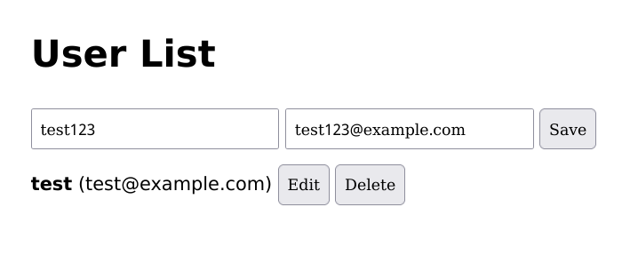
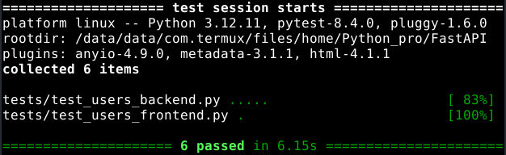

---

# FastAPI User Manager

A simple full-stack application for managing users.  
Built with **FastAPI** (backend), **vanilla HTML/JS** (frontend), and tested using **Selenium** and **Pytest**.

---

## 🚀 Features

- Create / Read / Update / Delete (CRUD) users
- Frontend connected to FastAPI backend
- Fast and lightweight – no frontend frameworks
- End-to-end tests with Selenium (Firefox / Geckodriver)
- Backend API tests using Pytest

---

## 🧱 Project Structure

```
FastAPI/
├── main.py                     # FastAPI app with routes (entry point)
├── database.py                 # SQLAlchemy engine and session management
├── models.py                   # SQLAlchemy User model
├── schemas.py                  # Pydantic schemas for request/response validation
├── index.html                  # Minimal frontend for interacting with the API
├── requirements.txt            # List of Python dependencies
├── tests/
│   ├── test_users_backend.py   # Backend tests using FastAPI's TestClient
│   ├── test_users_frontend.py  # End-to-end frontend tests with Selenium
│   ├── conftest.py             # Pytest fixtures for shared test setup
│   ├── utils.py                # Selenium utility functions (add/edit/delete user)
│   └── pytest.ini              # Pytest configuration
└── README.md                   # Project documentation

````

---

## 📦 Requirements

Install Python dependencies:

```bash
pip install -r requirements.txt
```
---

## 🖥️ Running the App

1. Start backend (from project root):

```bash
uvicorn main:app --host 0.0.0.0 --port 8000
````

2. Open the `index.html` file in your browser, or serve it with a static server. Make sure the API URL in `index.html` (variable `apiUrl`) matches your backend address and port.

---


Selenium also requires:

* Firefox browser
* [Geckodriver](https://github.com/mozilla/geckodriver/releases) in your PATH

---

## ✅ Running Tests

From the project root, run all tests:

```bash
pytest
```

Tests are located in the `tests/` directory and include:

* `test_users_backend.py` — API tests via `TestClient`
* `test_users_frontend.py` — Frontend automation using Selenium

---

## 📸 Screenshots

<p align="center">
  
  
</p>

---

## 📄 License

MIT License – use freely for learning or testing.

---

## 🙋 Author

jezierski999@gmail.com
